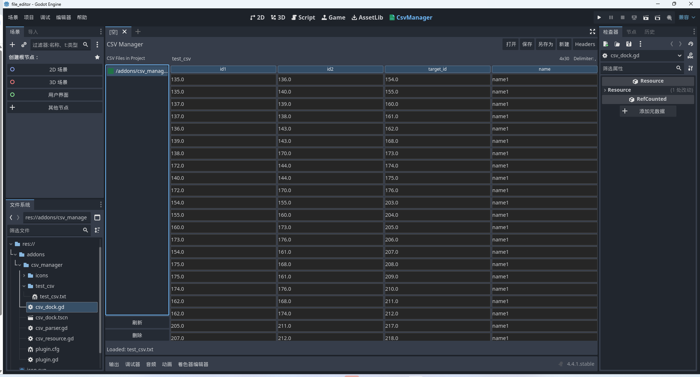

# GodotEasyCsv

[English](README_en.md)

基于Godot4.4.1版本的一个小巧的Godot可视化csv管理插件。
因为我在github上搜索相关可视化godot编辑器没有，唯一一个还是3.3版本的，所以我花费半天做了个这个插件。有更好的，也欢迎issues补充。

用法：

将项目clone下来，将addons里的文件拷贝到自己的addons文件夹下，在项目配置里面启用插件

优点:
- 支持内部直接编辑对应的csv文件，并自动转为_csv.txt后缀的文件，防止godot导出丢失。
- AI生成，结构清晰，代码简单，可自由定制。
- 支持批量删除，删除指定列和指定行的功能。

快捷键:
- ctrl + shift + 1 删除指定行
- ctrl + shift + 2 删除指定列
- ctrl + shift + 3 选中全部
- ctrl + shift + 4 取消全部
- 按住ctrl + 鼠标左键可以选中

对cell格右键支持直接删除当前行、当前列、删除选中行、删除选中列

