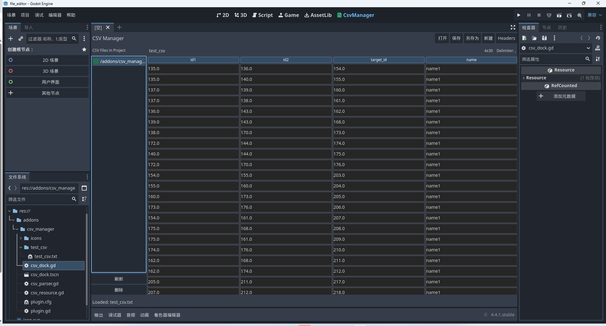

# GodotEasyCsv

[中文](README.md)

A lightweight Godot CSV management plugin with visual editing, based on Godot 4.4.1.
Since I couldn't find any visual CSV editor plugins for Godot on GitHub (the only available one was for version 3.3), I spent half a day developing this plugin. If you know of a better alternative, feel free to submit an issue.

Usage:

Clone the repository, copy the files from the addons folder into your project's addons directory, and enable the plugin in the project settings.

Features:

Supports in-editor CSV file editing and automatically converts files to _csv.txt format to prevent data loss during Godot exports.

AI-assisted generation, clean structure, simple code, and customizable.

Supports batch deletion, removing specific rows or columns.

Shortcuts:
- Ctrl + Shift + 1: Delete selected row
- Ctrl + Shift + 2: Delete selected column
- Ctrl + Shift + 3: Select all
- Ctrl + Shift + 4: Deselect all
- Ctrl + Left-click: Multi-select cells

Right-click context menu on cells:
- Delete current row
- Delete current column
- Delete selected rows
- Delete selected columns

